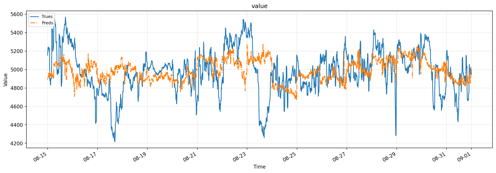
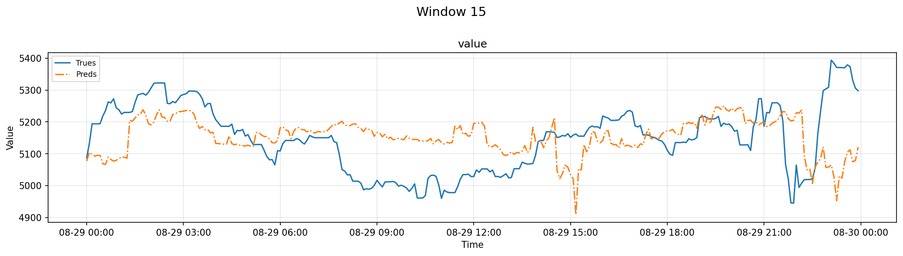
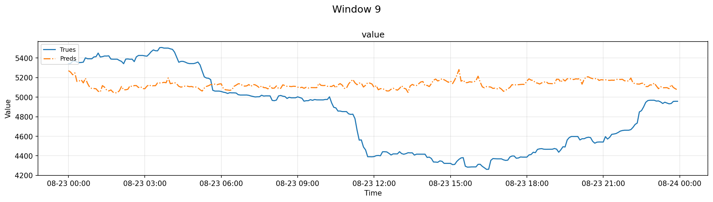
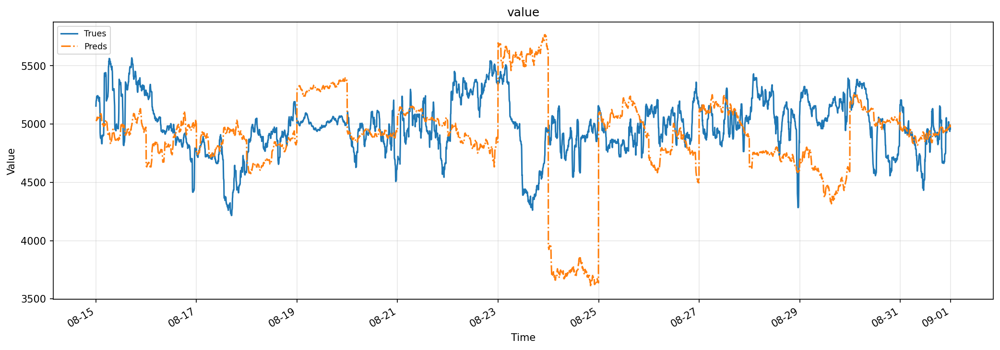

# 联通 IT 机房负荷预测模型测试报告

**测试对象**：联通 IT 机房总有功功率（单位：千瓦）
**预测任务**：每天一次，预测未来 24 小时、每 5 分钟一个点（全天 288 个点）
**测试区间**：2026 年 8 月 15 日至 8 月 31 日，共 17 天，逐日滚动测试，合计 4896 个预测点
**建模方式**：以历史 14 天数据为训练窗口，每天重新训练、预测次日全天曲线

---

## 一、指标口径说明

| 指标 | 含义 | 读法 |
| --- | --- | --- |
| MAE（平均绝对误差） | 预测值与实际值偏差的平均水平 | 越小越好，单位千瓦 |
| RMSE（均方根误差） | 对大偏差更敏感的误差水平 | 越小越好，单位千瓦 |
| MAPE（平均相对误差） | 偏差占实际值的平均比例 | 越小越好 |
| 准确率（1 − MAPE） | 相对精度的直观表达 | 越接近 100% 越好 |
| R²（拟合优度） | 相对"用全程平均值直接估计"这一参照的提升程度 | 越接近 1 越好；见第六节说明 |

## 二、三种预测方式

全部实验在三种预测方式下分别验证：

| 方式 | 说明 |
| --- | --- |
| 逐时刻建模 | 为未来一天 288 个时刻分别建立独立模型 |
| 整段统一建模 | 用一个模型统一预测全天 288 个时刻 |
| 整段统一建模＋时刻提示 | 在上一方式基础上，额外告诉模型每个时刻在全天中的位置 |

## 三、分步实验结果

### 第 1 步：基础模型 → 基础优化模型

基础模型仅使用历史负荷、日历和节假日信息；基础优化模型在此基础上加入近期状态统计、历史同槽统计与更保守的参数组合。

| 方案 | 预测方式 | MAE（千瓦） | RMSE（千瓦） | MAPE | 准确率 | R² |
| --- | --- | --- | --- | --- | --- | --- |
| 基础模型 | 逐时刻建模 | 214.4 | 275.0 | 4.36% | 95.64% | −0.316 |
| 基础模型 | 整段统一建模 | 185.8 | 255.1 | **3.79%** | **96.21%** | −0.132 |
| 基础模型 | 整段统一建模＋时刻提示 | 188.2 | 255.2 | 3.84% | 96.16% | −0.133 |
| 基础优化模型 | 逐时刻建模 | 214.7 | 281.5 | 4.37% | 95.63% | −0.379 |
| 基础优化模型 | 整段统一建模 | 199.4 | 257.1 | 4.05% | 95.95% | −0.150 |
| 基础优化模型 | 整段统一建模＋时刻提示 | 198.5 | 258.6 | 4.04% | 95.96% | −0.163 |

**结论**：三种方式中"整段统一建模"稳定最优；基础优化模型的各项调整未带来改善，说明在当前数据条件下，简单配置已接近可达到的精度水平。作为参照，传统统计方法相对误差为 5.39%，明显弱于以上数据驱动方案。

### 第 2 步：加入天气因素 → 天气＋优化组合

加入温度、湿度、太阳辐射、风速、气压、降雨六项天气因素。

| 方案 | 预测方式 | MAE（千瓦） | RMSE（千瓦） | MAPE | 准确率 | R² |
| --- | --- | --- | --- | --- | --- | --- |
| 基础模型＋天气 | 逐时刻建模 | 217.1 | 276.9 | 4.40% | 95.60% | −0.334 |
| 基础模型＋天气 | 整段统一建模 | 200.3 | 275.7 | 4.09% | 95.91% | −0.323 |
| 基础模型＋天气 | 整段统一建模＋时刻提示 | 199.9 | 268.5 | 4.07% | 95.93% | −0.254 |
| 天气＋优化组合 | 逐时刻建模 | 216.9 | 285.9 | 4.40% | 95.60% | −0.422 |
| 天气＋优化组合 | 整段统一建模 | 220.5 | 285.0 | 4.47% | 95.53% | −0.413 |
| 天气＋优化组合 | 整段统一建模＋时刻提示 | 217.4 | 285.4 | 4.42% | 95.58% | −0.417 |

**结论**：天气因素未带来改善。该机房负荷主要由设备运行负载驱动，对室外天气不敏感，符合机房类负荷的业务直觉。

### 第 3 步：加入算力运行指标（训练任务 / 推理任务）

分别加入两类算力运行指标：训练任务的处理器利用率、图形处理器功耗等（3 项）；推理任务的显存占用、内存占用等（4 项）。

| 方案 | 预测方式 | MAE（千瓦） | RMSE（千瓦） | MAPE | 准确率 | R² |
| --- | --- | --- | --- | --- | --- | --- |
| 基础模型＋训练算力 | 逐时刻建模 | 215.7 | 277.4 | 4.39% | 95.61% | −0.339 |
| 基础模型＋训练算力 | 整段统一建模 | 189.7 | 258.2 | 3.88% | 96.12% | −0.160 |
| 基础模型＋训练算力 | 整段统一建模＋时刻提示 | 191.0 | 257.8 | 3.90% | 96.10% | −0.156 |
| 基础模型＋推理算力 | 逐时刻建模 | 222.7 | 281.5 | 4.53% | 95.47% | −0.379 |
| 基础模型＋推理算力 | 整段统一建模 | 184.2 | 250.7 | **3.77%** | **96.23%** | −0.094 |
| 基础模型＋推理算力 | 整段统一建模＋时刻提示 | 186.6 | 248.0 | 3.81% | 96.19% | −0.070 |

**结论**：单独加入任一类算力指标，精度与基础模型基本持平；其中推理算力方向略优（最优方式相对误差 3.77%，与基础模型的 3.79% 相差在 0.02 个百分点以内，属持平偏好）。这提示两类算力指标可能各自只携带了部分有效信息。

### 第 4 步：精度专项验证

以最优方式（整段统一建模）为统一底座，逐项验证八类精度改进方向：

| 改进方向 | MAE（千瓦） | RMSE（千瓦） | MAPE | 准确率 | R² |
| --- | --- | --- | --- | --- | --- |
| 原样对照 | 185.8 | 255.1 | 3.79% | 96.21% | −0.132 |
| 加入近期状态特征 | 185.0 | 252.8 | **3.78%** | **96.22%** | −0.112 |
| 自动特征筛选 | 186.5 | 253.2 | 3.83% | 96.17% | −0.116 |
| 更换算法实现（同类方案） | 188.6 | 251.4 | 3.85% | 96.15% | −0.100 |
| 更保守的参数组合 | 189.1 | 257.5 | 3.86% | 96.14% | −0.153 |
| 更换误差计算口径（稳健口径） | 195.0 | 254.1 | 3.96% | 96.04% | −0.123 |
| 更换误差计算口径（平方口径） | 202.3 | 276.0 | 4.13% | 95.87% | −0.325 |
| 更换算法实现（简单线性方案） | 347.1 | 468.4 | 7.02% | 92.98% | −2.818 |

**结论**：唯一有效的小幅改进是"近期状态特征"（3.79% → 3.78%）；更换算法实现、更换误差计算口径、保守参数和特征筛选均无收益，简单线性方案明显不适用。该结论直接指导了第 5 步的组合方案设计。

### 第 5 步：组合方案（训练算力＋推理算力＋近期状态）

将第 3 步的两类算力指标与第 4 步验证有效的近期状态特征组合。

| 方案 | 预测方式 | MAE（千瓦） | RMSE（千瓦） | MAPE | 准确率 | R² |
| --- | --- | --- | --- | --- | --- | --- |
| 组合方案 | 逐时刻建模 | 211.6 | 273.3 | 4.31% | 95.69% | −0.300 |
| 组合方案 | 整段统一建模 | **181.7** | **243.2** | **3.71%** | **96.29%** | −0.029 |
| 组合方案 | 整段统一建模＋时刻提示 | 184.3 | 244.2 | 3.76% | 96.24% | −0.037 |

**结论**：组合方案取得全部实验的最好成绩——平均相对误差 3.71%、准确率 96.29%、平均绝对误差 181.7 千瓦，较基础模型（3.79%）降低约 2%，且优于任一单项改进，说明算力指标与近期状态提供了互补信息。

## 四、综合结论

1. **推荐方案**：整段统一建模方式 ＋ 训练算力指标 ＋ 推理算力指标 ＋ 近期状态特征，测试期平均相对误差 **3.71%**（准确率 96.29%）。
2. 与业务常用参照"昨日同一时刻"（相对误差约 5.2%）相比，推荐方案误差降低约 **29%**。
3. 各改进方向的真实效果排序：算力＋近期状态组合（有效）＞ 单项算力指标（持平偏好）＞ 近期状态单项（微幅有效）＞ 天气、参数优化、更换算法实现或误差计算口径（无效）。
4. 改善幅度总体有限，主要原因是测试期负荷本身高度平稳，可进一步压缩的误差空间不大。

## 五、预测效果可视化

以下两图为整个测试期（8 月 15 日至 31 日）预测曲线与实际负荷曲线的逐日拼接对比：实线为实际负荷，点划线为预测值。

**表现最好的方案——组合方案（整段统一建模）**：全期平均相对误差 3.71%，预测曲线与实际负荷走势高度贴合。

进一步放大到单日，看推荐方案内部最好与最差的两扇窗口：

**推荐方案表现最好的一天——8 月 29 日**：当日相对误差 1.80%（准确率 98.20%），预测曲线几乎与实际负荷重合。

**推荐方案表现最差的一天——8 月 23 日**：当日相对误差 9.29%（准确率 90.71%），为全部 17 个测试日中唯一超过 9% 的一天。当日午后负荷出现明显下探（从约 5400 千瓦降至约 4320 千瓦），模型未能跟上这次下探，误差集中在 11 时至 21 时，15 时前后最大偏差约 900 千瓦（预测偏高）。

**表现最差的方案——精度专项中的「更换算法实现（简单线性方案）」**：全期平均相对误差 7.02%，约为推荐方案的 1.9 倍；预测整体平均偏低约 89 千瓦，大偏差时段明显更多。

两图对比可直观看出：推荐方案在全天各时段都能稳定跟随实际负荷，而不适用的方案会出现持续性偏移和更大的局部偏差。

## 六、数据与测试边界说明

- 2026 年 8 月 19 日原始采集数据缺失一整天，已用当月 1–18 日同一时刻的算术平均值补齐；该日误差是相对补全数据的近似评估。
- 本报告全部结果来自历史数据逐日滚动回测（每天只用当时之前的数据训练），与未来实际运行的表现可能存在差异。
- R² 接近零或为负是测试期负荷高度平稳所致（见第一节说明），不影响 MAE、MAPE 等误差指标的有效性。
