# AIDC 暖通负荷预测模型测试报告

**测试对象**：数据中心三楼汇总暖通负荷，A、B 两路分别预测（单位：千瓦；测试期 A 路日均约 2000 千瓦、B 路日均约 1800 千瓦）
**预测任务**：每天一次，预测未来 24 小时、每 5 分钟一个点（全天 288 个点）
**测试区间**：2026 年 8 月 1 日至 8 月 17 日，共 17 天，逐日滚动测试，每路合计 4896 个预测点
**建模方式**：以历史 7 天数据为训练窗口，每天重新训练、预测次日全天曲线
**实验规模**：4 组信息组合 × 2 种设备口径 × 2 条路线 × 9 种预测方式，共 144 个实验，全部完成

---

## 一、指标口径说明

| 指标 | 含义 | 读法 |
| --- | --- | --- |
| MAE（平均绝对误差） | 预测值与实际值偏差的平均水平 | 越小越好，单位千瓦 |
| RMSE（均方根误差） | 对大偏差更敏感的误差水平 | 越小越好，单位千瓦 |
| MAPE（平均相对误差） | 偏差占实际值的平均比例 | 越小越好 |
| 准确率（1 − MAPE） | 相对精度的直观表达 | 越接近 100% 越好 |

另以业务常用参照「昨日同一时刻」（naive）作对照：A 路全期相对误差 4.99%，B 路 4.94%。

## 二、数据情况

### 数据窗口与规模

| 数据 | 时间范围 | 天数 | 行数（5 分钟一点） | 用途 |
| --- | --- | --- | --- | --- |
| `data.csv`（三楼汇总暖通负荷） | 2026-07-25 00:00 ～ 2026-08-17 23:55 | 24 天 | 6912 | 基础信息、＋天气、＋另一路历史三组的输入 |
| `data_with_it.csv`（暖通＋IT 负荷） | 2026-08-04 00:00 ～ 2026-08-17 23:55 | 14 天 | 4032 | ＋IT 负荷历史组的输入 |

- 两种设备口径（全量设备 / 剔除冷冻水二次泵）的时间范围完全相同，仅汇总范围不同；A、B 两条路线的输入文件内容一致，路线目录只区分预测目标列。
- 训练与测试划分：以历史 7 天为训练窗口逐日滚动。`data.csv` 可支撑 17 个测试日（8 月 1 日至 17 日）；`data_with_it.csv` 因 IT 负荷数据仅覆盖 8 月 4 日起，只能支撑 7 个测试日（8 月 11 日至 17 日），这是第 4 步采用配对 7 天口径的原因。
- 天气数据与每份目标文件独立配套、时间逐行对齐，窗口与对应目标文件一致。
- 完整性：预测输入文件缺失单元格为 0、无限值为 0、负值为 0；原始采集中的缺失与异常已在离线数据准备阶段处理（见下）。

### 数据清洗情况

预测数据使用红框事件离线清洗版本：对人工圈定的运行扰动时段，以事件前 1 小时的原始观测为基线识别异常点位，再用只依赖过去数据的规则重新估计，共修正 3950 个物理点位-时刻（传播到 32 份预测文件合计 10448 格）。该清洗含人工离线复核，不代表严格在线可得（见第七节边界说明）。

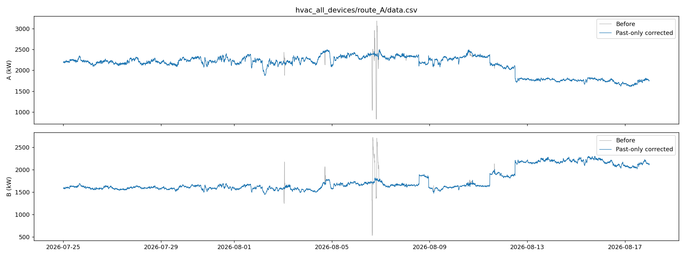

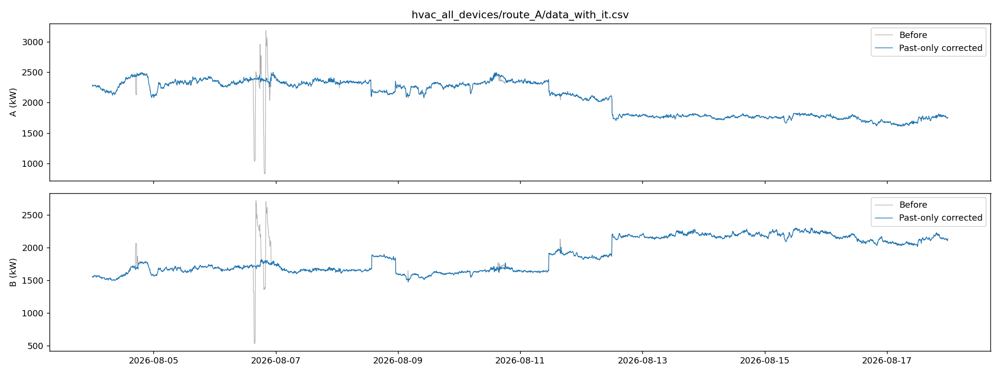

### 负荷曲线概览

下图为测试所用三楼汇总暖通负荷的完整历史曲线（橙色段为含估计点位的汇总值）：

**全量设备口径，A 路 / B 路：**

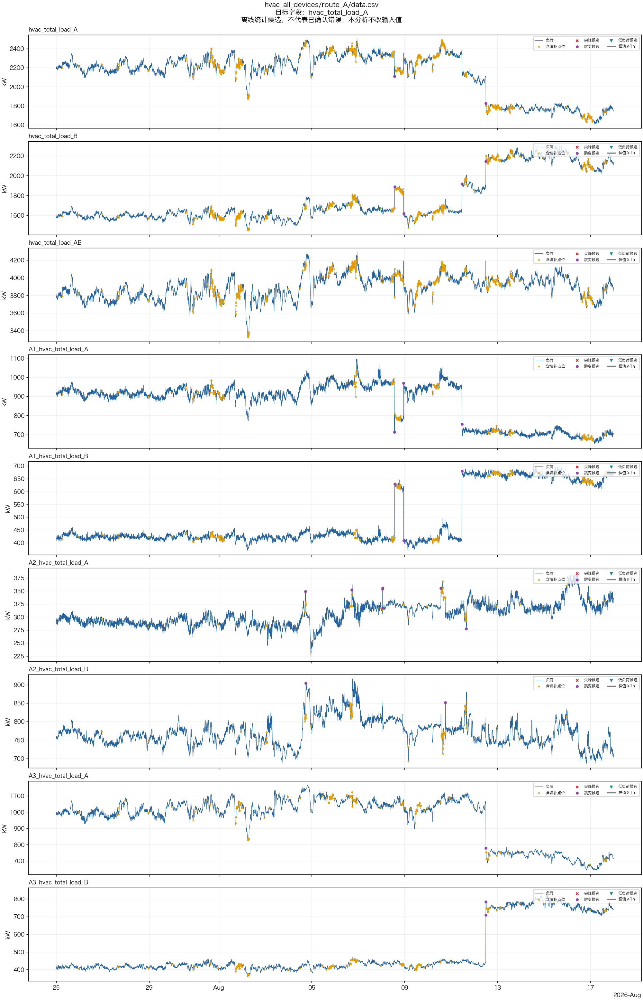

**剔除冷冻水二次泵口径，A 路 / B 路：**

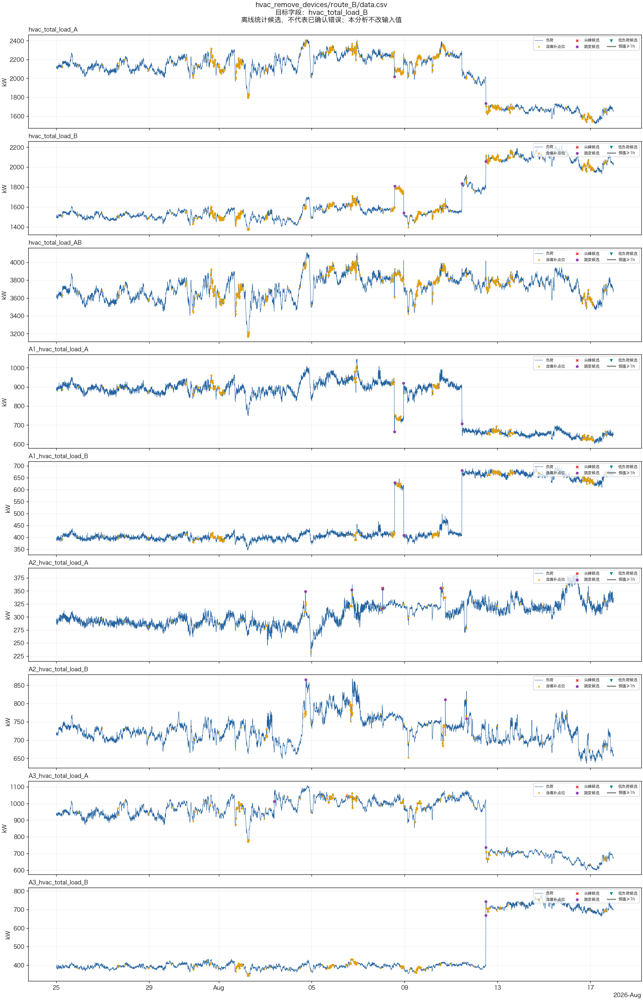

**含 IT 负荷文件（8 月 4 日至 17 日）与 A 路日内热力图：**

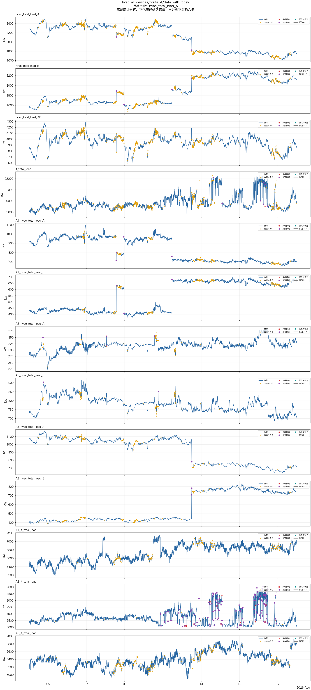

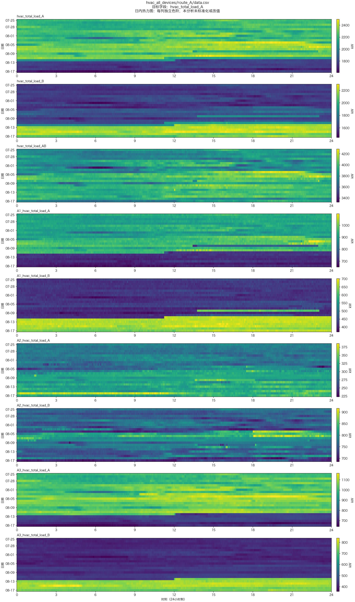

从曲线形态看，暖通负荷整体平稳、日内波动幅度有限，但存在个别工况切换日（如 8 月 12 日两路负荷此消彼长），这类日子是测试误差的主要来源（见第五、六节）。

## 三、实验设计

### 九种预测方式

| 方式 | 说明 |
| --- | --- |
| 逐时刻建模 | 为全天 288 个时刻分别建立独立模型 |
| 整段统一建模 | 用一个模型统一预测全天 288 个时刻 |
| 整段统一建模＋时刻提示 | 在上一方式基础上，额外告诉模型每个时刻在全天中的位置 |
| 逐步递推 | 只建立「下一个点」的模型，逐点滚动预测全天 |
| 全天整体输出 | 一个模型一次性输出全天 288 个点 |
| 分块滚动 | 一个模型每次输出 2 小时（24 点），滚动 12 块拼出全天 |
| 逐时刻建模＋递推修正 | 逐时刻独立建模，并用前一位置的预测结果修正 |
| 分块独立建模 | 全天切成 12 块（每块 2 小时），每块单独建模 |
| 分块独立建模＋递推修正 | 分块独立建模，并用前一块的预测结果修正 |

说明：本场景所有特征均取自至少一天之前的历史，「逐步递推」在滚动过程中不依赖当天的预测值，因此与「整段统一建模」在数学上等价——全部 16 个对照实验中两者结果完全一致，下同不重复解释。

### 四组信息组合

| 组 | 入模信息 |
| --- | --- |
| 基础信息 | 本路历史负荷 ＋ 日历 ＋ 节假日 |
| ＋天气 | 在基础信息上加入温度、湿度、太阳辐射、风速、气压、降雨六项天气因素（历史段用实测，测试段用预报） |
| ＋IT 负荷历史 | 在基础信息上加入机房 IT 总负荷历史 |
| ＋另一路历史 | 在基础信息上加入另一路（A↔B）暖通负荷历史 |

### 两种设备口径

| 口径 | 说明 |
| --- | --- |
| 全量设备 | 三楼全部暖通设备负荷汇总 |
| 剔除冷冻水二次泵 | 汇总时剔除「冷冻水二次泵」设备组 |

## 四、分步实验结果

> 表中加粗红色为该维度（设备口径 × 路线）下按 MAPE 最优的结果。

### 第 1 步：九种预测方式对比（基础信息组，17 天全期）

| 设备口径 | 路线 | 预测方式 | MAE（千瓦） | RMSE（千瓦） | MAPE | 准确率 |
| --- | --- | --- | --- | --- | --- | --- |
| 全量设备 | A 路 | 逐时刻建模 | 123.4 | 142.1 | 6.17% | 93.83% |
| 全量设备 | A 路 | 整段统一建模 | 94.4 | 112.9 | **4.70%** | **95.30%** |
| 全量设备 | A 路 | 整段统一建模＋时刻提示 | 95.4 | 114.4 | 4.75% | 95.25% |
| 全量设备 | A 路 | 逐步递推 | 94.4 | 112.9 | 4.70% | 95.30% |
| 全量设备 | A 路 | 全天整体输出 | 122.2 | 140.9 | 6.12% | 93.88% |
| 全量设备 | A 路 | 分块滚动 | 98.2 | 116.2 | 4.88% | 95.12% |
| 全量设备 | A 路 | 逐时刻建模＋递推修正 | 123.4 | 142.2 | 6.17% | 93.83% |
| 全量设备 | A 路 | 分块独立建模 | 122.8 | 141.8 | 6.16% | 93.84% |
| 全量设备 | A 路 | 分块独立建模＋递推修正 | 122.0 | 140.1 | 6.10% | 93.90% |
| 全量设备 | B 路 | 逐时刻建模 | 103.6 | 118.6 | 5.51% | 94.49% |
| 全量设备 | B 路 | 整段统一建模 | 84.2 | 98.7 | **4.53%** | **95.47%** |
| 全量设备 | B 路 | 整段统一建模＋时刻提示 | 85.3 | 100.5 | 4.58% | 95.42% |
| 全量设备 | B 路 | 逐步递推 | 84.2 | 98.7 | 4.53% | 95.47% |
| 全量设备 | B 路 | 全天整体输出 | 106.8 | 121.5 | 5.68% | 94.32% |
| 全量设备 | B 路 | 分块滚动 | 86.3 | 101.8 | 4.64% | 95.36% |
| 全量设备 | B 路 | 逐时刻建模＋递推修正 | 100.9 | 116.1 | 5.39% | 94.61% |
| 全量设备 | B 路 | 分块独立建模 | 104.9 | 119.7 | 5.58% | 94.42% |
| 全量设备 | B 路 | 分块独立建模＋递推修正 | 102.5 | 117.8 | 5.46% | 94.54% |
| 剔除二次泵 | A 路 | 逐时刻建模 | 123.1 | 142.7 | 6.48% | 93.52% |
| 剔除二次泵 | A 路 | 整段统一建模 | 96.7 | 115.1 | 5.05% | 94.95% |
| 剔除二次泵 | A 路 | 整段统一建模＋时刻提示 | 96.1 | 115.2 | **5.01%** | **94.99%** |
| 剔除二次泵 | A 路 | 逐步递推 | 96.7 | 115.1 | 5.05% | 94.95% |
| 剔除二次泵 | A 路 | 全天整体输出 | 122.0 | 141.6 | 6.42% | 93.58% |
| 剔除二次泵 | A 路 | 分块滚动 | 97.0 | 114.9 | 5.04% | 94.96% |
| 剔除二次泵 | A 路 | 逐时刻建模＋递推修正 | 122.8 | 142.3 | 6.46% | 93.54% |
| 剔除二次泵 | A 路 | 分块独立建模 | 122.4 | 142.1 | 6.45% | 93.55% |
| 剔除二次泵 | A 路 | 分块独立建模＋递推修正 | 121.6 | 140.4 | 6.40% | 93.60% |
| 剔除二次泵 | B 路 | 逐时刻建模 | 99.8 | 115.6 | 5.57% | 94.43% |
| 剔除二次泵 | B 路 | 整段统一建模 | 89.3 | 104.4 | 5.02% | 94.98% |
| 剔除二次泵 | B 路 | 整段统一建模＋时刻提示 | 87.0 | 101.9 | 4.89% | 95.11% |
| 剔除二次泵 | B 路 | 逐步递推 | 89.3 | 104.4 | 5.02% | 94.98% |
| 剔除二次泵 | B 路 | 全天整体输出 | 103.2 | 118.5 | 5.74% | 94.26% |
| 剔除二次泵 | B 路 | 分块滚动 | 86.7 | 102.1 | **4.88%** | **95.12%** |
| 剔除二次泵 | B 路 | 逐时刻建模＋递推修正 | 99.2 | 114.8 | 5.55% | 94.45% |
| 剔除二次泵 | B 路 | 分块独立建模 | 101.0 | 116.8 | 5.63% | 94.37% |
| 剔除二次泵 | B 路 | 分块独立建模＋递推修正 | 100.3 | 116.2 | 5.60% | 94.40% |

**自身结果结论**：

- 九种预测方式清晰分为两档：
  - 第一档：整段统一建模、逐步递推、整段统一建模＋时刻提示、分块滚动，各维度 MAPE 约 4.5%–5.1%；
  - 第二档：逐时刻建模、全天整体输出、逐时刻建模＋递推修正、分块独立建模、分块独立建模＋递推修正，MAPE 约 5.4%–6.5%；
  - 两档差距约 1.4–1.5 个百分点，预测方式的选择是本轮实验中影响最大的单一因素。
- 各维度最优结果：全量设备 A 路 4.70%（整段统一建模）、全量设备 B 路 4.53%（整段统一建模）、剔除二次泵 A 路 5.01%（整段统一建模＋时刻提示）、剔除二次泵 B 路 4.88%（分块滚动）。
- 「逐步递推」与「整段统一建模」结果完全相同，为设计使然（特征均取自至少一天前，递推不依赖当天预测值），不是数据错误。
- 时刻提示相对整段统一建模无稳定增益（仅剔除口径两路有 0.04–0.13 个百分点的微弱改善）。
- 与「昨日同一时刻」参照对比：参照在全量口径 A 路 4.99%、B 路 4.94%，剔除口径 A 路 5.22%、B 路 5.11%；最优模型仅比参照低 0.2–0.5 个百分点，优势有限。
- 剔除二次泵口径下九种方式普遍略差于全量设备口径，且参照误差同步变大，说明该口径负荷本身更难预测，并非模型退化。

### 第 2 步：加入天气因素（17 天全期）

加入温度、湿度、太阳辐射、风速、气压、降雨六项天气因素（历史段用实测，测试段用预报）。

| 设备口径 | 路线 | 预测方式 | MAE（千瓦） | RMSE（千瓦） | MAPE | 准确率 |
| --- | --- | --- | --- | --- | --- | --- |
| 全量设备 | A 路 | 逐时刻建模 | 117.9 | 135.6 | 5.95% | 94.05% |
| 全量设备 | A 路 | 整段统一建模 | 95.3 | 112.9 | **4.81%** | **95.19%** |
| 全量设备 | A 路 | 整段统一建模＋时刻提示 | 97.3 | 115.4 | 4.92% | 95.08% |
| 全量设备 | A 路 | 逐步递推 | 95.3 | 112.9 | 4.81% | 95.19% |
| 全量设备 | A 路 | 全天整体输出 | 115.8 | 134.8 | 5.77% | 94.23% |
| 全量设备 | A 路 | 分块滚动 | 95.9 | 113.8 | 4.82% | 95.18% |
| 全量设备 | A 路 | 逐时刻建模＋递推修正 | 117.0 | 134.8 | 5.90% | 94.10% |
| 全量设备 | A 路 | 分块独立建模 | 118.2 | 136.5 | 5.96% | 94.04% |
| 全量设备 | A 路 | 分块独立建模＋递推修正 | 117.3 | 135.3 | 5.90% | 94.10% |
| 全量设备 | B 路 | 逐时刻建模 | 101.8 | 116.5 | 5.37% | 94.63% |
| 全量设备 | B 路 | 整段统一建模 | 94.3 | 108.2 | **5.03%** | **94.97%** |
| 全量设备 | B 路 | 整段统一建模＋时刻提示 | 94.9 | 108.4 | 5.07% | 94.93% |
| 全量设备 | B 路 | 逐步递推 | 94.3 | 108.2 | 5.03% | 94.97% |
| 全量设备 | B 路 | 全天整体输出 | 105.1 | 119.9 | 5.58% | 94.42% |
| 全量设备 | B 路 | 分块滚动 | 97.5 | 113.5 | 5.17% | 94.83% |
| 全量设备 | B 路 | 逐时刻建模＋递推修正 | 99.3 | 113.8 | 5.25% | 94.75% |
| 全量设备 | B 路 | 分块独立建模 | 104.6 | 119.0 | 5.52% | 94.48% |
| 全量设备 | B 路 | 分块独立建模＋递推修正 | 103.0 | 117.2 | 5.44% | 94.56% |
| 剔除二次泵 | A 路 | 逐时刻建模 | 117.7 | 136.2 | 6.24% | 93.76% |
| 剔除二次泵 | A 路 | 整段统一建模 | 94.7 | 113.3 | **4.99%** | **95.01%** |
| 剔除二次泵 | A 路 | 整段统一建模＋时刻提示 | 95.8 | 114.3 | 5.07% | 94.93% |
| 剔除二次泵 | A 路 | 逐步递推 | 94.7 | 113.3 | 4.99% | 95.01% |
| 剔除二次泵 | A 路 | 全天整体输出 | 115.6 | 135.7 | 6.05% | 93.95% |
| 剔除二次泵 | A 路 | 分块滚动 | 95.6 | 113.7 | 5.04% | 94.96% |
| 剔除二次泵 | A 路 | 逐时刻建模＋递推修正 | 117.3 | 135.8 | 6.21% | 93.79% |
| 剔除二次泵 | A 路 | 分块独立建模 | 118.1 | 137.4 | 6.26% | 93.74% |
| 剔除二次泵 | A 路 | 分块独立建模＋递推修正 | 117.6 | 136.3 | 6.22% | 93.78% |
| 剔除二次泵 | B 路 | 逐时刻建模 | 99.1 | 114.1 | 5.47% | 94.53% |
| 剔除二次泵 | B 路 | 整段统一建模 | 98.6 | 111.9 | 5.47% | 94.53% |
| 剔除二次泵 | B 路 | 整段统一建模＋时刻提示 | 99.3 | 112.9 | 5.52% | 94.48% |
| 剔除二次泵 | B 路 | 逐步递推 | 98.6 | 111.9 | 5.47% | 94.53% |
| 剔除二次泵 | B 路 | 全天整体输出 | 101.3 | 116.4 | 5.62% | 94.38% |
| 剔除二次泵 | B 路 | 分块滚动 | 97.4 | 113.2 | **5.39%** | **94.61%** |
| 剔除二次泵 | B 路 | 逐时刻建模＋递推修正 | 98.0 | 112.6 | 5.42% | 94.58% |
| 剔除二次泵 | B 路 | 分块独立建模 | 102.3 | 117.1 | 5.65% | 94.35% |
| 剔除二次泵 | B 路 | 分块独立建模＋递推修正 | 101.3 | 115.9 | 5.60% | 94.40% |

**自身结果结论**：

- 方式两档格局与基础信息组完全一致，各维度最优仍为第一档方式：全量设备 A 路 4.81%（整段统一建模）、全量设备 B 路 5.03%（整段统一建模）、剔除二次泵 A 路 4.99%（整段统一建模）、剔除二次泵 B 路 5.39%（分块滚动）。
- 组内绝对水平整体略逊于基础信息组，天气未改变方式间的排序。

**与基础信息组对比**（Δ = 本组 − 基础信息，负值为改善）：

| 设备口径 | 路线 | 预测方式 | 基础信息 MAPE | 本组 MAPE | ΔMAPE（百分点） | Δ准确率（百分点） |
| --- | --- | --- | --- | --- | --- | --- |
| 全量设备 | A 路 | 逐时刻建模 | 6.17% | 5.95% | -0.22 | +0.22 |
| 全量设备 | A 路 | 整段统一建模 | 4.70% | 4.81% | +0.11 | -0.11 |
| 全量设备 | A 路 | 整段统一建模＋时刻提示 | 4.75% | 4.92% | +0.17 | -0.17 |
| 全量设备 | A 路 | 逐步递推 | 4.70% | 4.81% | +0.11 | -0.11 |
| 全量设备 | A 路 | 全天整体输出 | 6.12% | 5.77% | -0.35 | +0.35 |
| 全量设备 | A 路 | 分块滚动 | 4.88% | 4.82% | -0.06 | +0.06 |
| 全量设备 | A 路 | 逐时刻建模＋递推修正 | 6.17% | 5.90% | -0.28 | +0.28 |
| 全量设备 | A 路 | 分块独立建模 | 6.16% | 5.96% | -0.20 | +0.20 |
| 全量设备 | A 路 | 分块独立建模＋递推修正 | 6.10% | 5.90% | -0.20 | +0.20 |
| 全量设备 | B 路 | 逐时刻建模 | 5.51% | 5.37% | -0.14 | +0.14 |
| 全量设备 | B 路 | 整段统一建模 | 4.53% | 5.03% | +0.49 | -0.49 |
| 全量设备 | B 路 | 整段统一建模＋时刻提示 | 4.58% | 5.07% | +0.49 | -0.49 |
| 全量设备 | B 路 | 逐步递推 | 4.53% | 5.03% | +0.49 | -0.49 |
| 全量设备 | B 路 | 全天整体输出 | 5.68% | 5.58% | -0.10 | +0.10 |
| 全量设备 | B 路 | 分块滚动 | 4.64% | 5.17% | +0.53 | -0.53 |
| 全量设备 | B 路 | 逐时刻建模＋递推修正 | 5.39% | 5.25% | -0.14 | +0.14 |
| 全量设备 | B 路 | 分块独立建模 | 5.58% | 5.52% | -0.06 | +0.06 |
| 全量设备 | B 路 | 分块独立建模＋递推修正 | 5.46% | 5.44% | -0.02 | +0.02 |
| 剔除二次泵 | A 路 | 逐时刻建模 | 6.48% | 6.24% | -0.24 | +0.24 |
| 剔除二次泵 | A 路 | 整段统一建模 | 5.05% | 4.99% | -0.06 | +0.06 |
| 剔除二次泵 | A 路 | 整段统一建模＋时刻提示 | 5.01% | 5.07% | +0.06 | -0.06 |
| 剔除二次泵 | A 路 | 逐步递推 | 5.05% | 4.99% | -0.06 | +0.06 |
| 剔除二次泵 | A 路 | 全天整体输出 | 6.42% | 6.05% | -0.37 | +0.37 |
| 剔除二次泵 | A 路 | 分块滚动 | 5.04% | 5.04% | -0.01 | +0.01 |
| 剔除二次泵 | A 路 | 逐时刻建模＋递推修正 | 6.46% | 6.21% | -0.25 | +0.25 |
| 剔除二次泵 | A 路 | 分块独立建模 | 6.45% | 6.26% | -0.19 | +0.19 |
| 剔除二次泵 | A 路 | 分块独立建模＋递推修正 | 6.40% | 6.22% | -0.18 | +0.18 |
| 剔除二次泵 | B 路 | 逐时刻建模 | 5.57% | 5.47% | -0.10 | +0.10 |
| 剔除二次泵 | B 路 | 整段统一建模 | 5.02% | 5.47% | +0.46 | -0.46 |
| 剔除二次泵 | B 路 | 整段统一建模＋时刻提示 | 4.89% | 5.52% | +0.63 | -0.63 |
| 剔除二次泵 | B 路 | 逐步递推 | 5.02% | 5.47% | +0.46 | -0.46 |
| 剔除二次泵 | B 路 | 全天整体输出 | 5.74% | 5.62% | -0.12 | +0.12 |
| 剔除二次泵 | B 路 | 分块滚动 | 4.88% | 5.39% | +0.51 | -0.51 |
| 剔除二次泵 | B 路 | 逐时刻建模＋递推修正 | 5.55% | 5.42% | -0.12 | +0.12 |
| 剔除二次泵 | B 路 | 分块独立建模 | 5.63% | 5.65% | +0.02 | -0.02 |
| 剔除二次泵 | B 路 | 分块独立建模＋递推修正 | 5.60% | 5.60% | -0.01 | +0.01 |

**对比结论**：

- B 路全面变差：两种口径下第一档方式普遍 +0.4～+0.5 个百分点（如全量 B 路整段统一建模 4.53%→5.03%，分块滚动 4.64%→5.17%），是四组外加信息中负面影响最明显的一处。
- A 路表现分裂：第一档方式略差（+0.06～+0.17 个百分点），第二档方式略好（−0.2～−0.35 个百分点），但第二档改善后仍明显落后于第一档，不构成实际收益。
- 剔除二次泵 A 路的整段统一建模是唯一基本持平偏好的组合（5.05%→4.99%）。
- 总体判断：在 7 天短训练窗下，天气变量引入的估计方差大于其信息增量；暖通负荷日内形状主要由运行工况决定，天气因素**无稳定收益，不建议采用**。

### 第 3 步：加入另一路负荷历史（17 天全期）

在基础信息上加入另一路（A↔B）暖通负荷历史。

| 设备口径 | 路线 | 预测方式 | MAE（千瓦） | RMSE（千瓦） | MAPE | 准确率 |
| --- | --- | --- | --- | --- | --- | --- |
| 全量设备 | A 路 | 逐时刻建模 | 123.2 | 142.1 | 6.18% | 93.82% |
| 全量设备 | A 路 | 整段统一建模 | 99.5 | 119.4 | 4.99% | 95.01% |
| 全量设备 | A 路 | 整段统一建模＋时刻提示 | 101.3 | 120.6 | 5.09% | 94.91% |
| 全量设备 | A 路 | 逐步递推 | 99.5 | 119.4 | 4.99% | 95.01% |
| 全量设备 | A 路 | 全天整体输出 | 122.1 | 141.0 | 6.12% | 93.88% |
| 全量设备 | A 路 | 分块滚动 | 98.4 | 116.4 | **4.92%** | **95.08%** |
| 全量设备 | A 路 | 逐时刻建模＋递推修正 | 123.7 | 142.5 | 6.18% | 93.82% |
| 全量设备 | A 路 | 分块独立建模 | 122.2 | 141.3 | 6.14% | 93.86% |
| 全量设备 | A 路 | 分块独立建模＋递推修正 | 122.8 | 140.9 | 6.14% | 93.86% |
| 全量设备 | B 路 | 逐时刻建模 | 106.3 | 120.8 | 5.63% | 94.37% |
| 全量设备 | B 路 | 整段统一建模 | 88.0 | 102.7 | **4.69%** | **95.31%** |
| 全量设备 | B 路 | 整段统一建模＋时刻提示 | 89.4 | 104.1 | 4.76% | 95.24% |
| 全量设备 | B 路 | 逐步递推 | 88.0 | 102.7 | 4.69% | 95.31% |
| 全量设备 | B 路 | 全天整体输出 | 108.4 | 122.6 | 5.76% | 94.24% |
| 全量设备 | B 路 | 分块滚动 | 88.5 | 103.2 | 4.73% | 95.27% |
| 全量设备 | B 路 | 逐时刻建模＋递推修正 | 103.6 | 118.1 | 5.51% | 94.49% |
| 全量设备 | B 路 | 分块独立建模 | 107.3 | 121.7 | 5.69% | 94.31% |
| 全量设备 | B 路 | 分块独立建模＋递推修正 | 104.2 | 118.8 | 5.54% | 94.46% |
| 剔除二次泵 | A 路 | 逐时刻建模 | 122.4 | 142.3 | 6.45% | 93.55% |
| 剔除二次泵 | A 路 | 整段统一建模 | 100.8 | 119.6 | 5.28% | 94.72% |
| 剔除二次泵 | A 路 | 整段统一建模＋时刻提示 | 99.4 | 119.1 | 5.23% | 94.77% |
| 剔除二次泵 | A 路 | 逐步递推 | 100.8 | 119.6 | 5.28% | 94.72% |
| 剔除二次泵 | A 路 | 全天整体输出 | 121.5 | 141.4 | 6.39% | 93.61% |
| 剔除二次泵 | A 路 | 分块滚动 | 96.6 | 114.8 | **5.06%** | **94.94%** |
| 剔除二次泵 | A 路 | 逐时刻建模＋递推修正 | 123.7 | 143.1 | 6.50% | 93.50% |
| 剔除二次泵 | A 路 | 分块独立建模 | 121.9 | 141.7 | 6.44% | 93.56% |
| 剔除二次泵 | A 路 | 分块独立建模＋递推修正 | 122.0 | 140.9 | 6.41% | 93.59% |
| 剔除二次泵 | B 路 | 逐时刻建模 | 102.6 | 117.8 | 5.70% | 94.30% |
| 剔除二次泵 | B 路 | 整段统一建模 | 88.3 | 102.8 | **4.93%** | **95.07%** |
| 剔除二次泵 | B 路 | 整段统一建模＋时刻提示 | 90.3 | 105.0 | 5.03% | 94.97% |
| 剔除二次泵 | B 路 | 逐步递推 | 88.3 | 102.8 | 4.93% | 95.07% |
| 剔除二次泵 | B 路 | 全天整体输出 | 104.6 | 119.3 | 5.81% | 94.19% |
| 剔除二次泵 | B 路 | 分块滚动 | 88.3 | 103.1 | 4.95% | 95.05% |
| 剔除二次泵 | B 路 | 逐时刻建模＋递推修正 | 102.1 | 116.8 | 5.69% | 94.31% |
| 剔除二次泵 | B 路 | 分块独立建模 | 103.4 | 118.7 | 5.75% | 94.25% |
| 剔除二次泵 | B 路 | 分块独立建模＋递推修正 | 102.2 | 117.2 | 5.69% | 94.31% |

**自身结果结论**：

- 方式两档格局不变，各维度最优：全量设备 A 路 4.92%（分块滚动）、全量设备 B 路 4.69%（整段统一建模）、剔除二次泵 A 路 5.06%（分块滚动）、剔除二次泵 B 路 4.93%（整段统一建模）。
- 绝对水平整体介于基础信息组与天气组之间。

**与基础信息组对比**（Δ = 本组 − 基础信息，负值为改善）：

| 设备口径 | 路线 | 预测方式 | 基础信息 MAPE | 本组 MAPE | ΔMAPE（百分点） | Δ准确率（百分点） |
| --- | --- | --- | --- | --- | --- | --- |
| 全量设备 | A 路 | 逐时刻建模 | 6.17% | 6.18% | +0.00 | -0.00 |
| 全量设备 | A 路 | 整段统一建模 | 4.70% | 4.99% | +0.29 | -0.29 |
| 全量设备 | A 路 | 整段统一建模＋时刻提示 | 4.75% | 5.09% | +0.34 | -0.34 |
| 全量设备 | A 路 | 逐步递推 | 4.70% | 4.99% | +0.29 | -0.29 |
| 全量设备 | A 路 | 全天整体输出 | 6.12% | 6.12% | -0.00 | +0.00 |
| 全量设备 | A 路 | 分块滚动 | 4.88% | 4.92% | +0.04 | -0.04 |
| 全量设备 | A 路 | 逐时刻建模＋递推修正 | 6.17% | 6.18% | +0.00 | -0.00 |
| 全量设备 | A 路 | 分块独立建模 | 6.16% | 6.14% | -0.02 | +0.02 |
| 全量设备 | A 路 | 分块独立建模＋递推修正 | 6.10% | 6.14% | +0.03 | -0.03 |
| 全量设备 | B 路 | 逐时刻建模 | 5.51% | 5.63% | +0.12 | -0.12 |
| 全量设备 | B 路 | 整段统一建模 | 4.53% | 4.69% | +0.16 | -0.16 |
| 全量设备 | B 路 | 整段统一建模＋时刻提示 | 4.58% | 4.76% | +0.17 | -0.17 |
| 全量设备 | B 路 | 逐步递推 | 4.53% | 4.69% | +0.16 | -0.16 |
| 全量设备 | B 路 | 全天整体输出 | 5.68% | 5.76% | +0.08 | -0.08 |
| 全量设备 | B 路 | 分块滚动 | 4.64% | 4.73% | +0.09 | -0.09 |
| 全量设备 | B 路 | 逐时刻建模＋递推修正 | 5.39% | 5.51% | +0.13 | -0.13 |
| 全量设备 | B 路 | 分块独立建模 | 5.58% | 5.69% | +0.11 | -0.11 |
| 全量设备 | B 路 | 分块独立建模＋递推修正 | 5.46% | 5.54% | +0.08 | -0.08 |
| 剔除二次泵 | A 路 | 逐时刻建模 | 6.48% | 6.45% | -0.03 | +0.03 |
| 剔除二次泵 | A 路 | 整段统一建模 | 5.05% | 5.28% | +0.24 | -0.24 |
| 剔除二次泵 | A 路 | 整段统一建模＋时刻提示 | 5.01% | 5.23% | +0.22 | -0.22 |
| 剔除二次泵 | A 路 | 逐步递推 | 5.05% | 5.28% | +0.24 | -0.24 |
| 剔除二次泵 | A 路 | 全天整体输出 | 6.42% | 6.39% | -0.03 | +0.03 |
| 剔除二次泵 | A 路 | 分块滚动 | 5.04% | 5.06% | +0.01 | -0.01 |
| 剔除二次泵 | A 路 | 逐时刻建模＋递推修正 | 6.46% | 6.50% | +0.04 | -0.04 |
| 剔除二次泵 | A 路 | 分块独立建模 | 6.45% | 6.44% | -0.02 | +0.02 |
| 剔除二次泵 | A 路 | 分块独立建模＋递推修正 | 6.40% | 6.41% | +0.01 | -0.01 |
| 剔除二次泵 | B 路 | 逐时刻建模 | 5.57% | 5.70% | +0.13 | -0.13 |
| 剔除二次泵 | B 路 | 整段统一建模 | 5.02% | 4.93% | -0.09 | +0.09 |
| 剔除二次泵 | B 路 | 整段统一建模＋时刻提示 | 4.89% | 5.03% | +0.14 | -0.14 |
| 剔除二次泵 | B 路 | 逐步递推 | 5.02% | 4.93% | -0.09 | +0.09 |
| 剔除二次泵 | B 路 | 全天整体输出 | 5.74% | 5.81% | +0.07 | -0.07 |
| 剔除二次泵 | B 路 | 分块滚动 | 4.88% | 4.95% | +0.07 | -0.07 |
| 剔除二次泵 | B 路 | 逐时刻建模＋递推修正 | 5.55% | 5.69% | +0.14 | -0.14 |
| 剔除二次泵 | B 路 | 分块独立建模 | 5.63% | 5.75% | +0.12 | -0.12 |
| 剔除二次泵 | B 路 | 分块独立建模＋递推修正 | 5.60% | 5.69% | +0.09 | -0.09 |

**对比结论**：

- 第一档方式普遍变差 +0.04～+0.34 个百分点，且 A、B 两路、两种口径方向一致，没有例外维度。
- 第二档方式几乎不变（±0.03 个百分点以内），说明该档方式的误差主要由自身结构决定，对协变量不敏感。
- 唯一实质改善的组合是剔除二次泵 B 路的整段统一建模（5.02%→4.93%，−0.09 个百分点），幅度小且孤立，不足以支持采用。
- 总体判断：两路负荷虽然物理上相关，但在日级预测任务中另一路历史不提供超出本路历史的增量信息，**无收益，不建议采用**。

### 第 4 步：加入 IT 负荷历史（配对 7 天口径）

IT 负荷数据仅覆盖 2026 年 8 月 4 日至 17 日，该组可用测试期为 8 月 11 日至 17 日共 7 天。为保证可比，本步自身结果与对比均统一按 **8 月 11 日至 17 日同一 7 天** 汇总（与前三步的 17 天全期数字不可直接对比）。

| 设备口径 | 路线 | 预测方式 | MAE（千瓦） | RMSE（千瓦） | MAPE | 准确率 |
| --- | --- | --- | --- | --- | --- | --- |
| 全量设备 | A 路 | 逐时刻建模 | 167.5 | 186.8 | 9.17% | 90.83% |
| 全量设备 | A 路 | 整段统一建模 | 119.9 | 135.5 | **6.54%** | **93.46%** |
| 全量设备 | A 路 | 整段统一建模＋时刻提示 | 124.7 | 140.5 | 6.82% | 93.18% |
| 全量设备 | A 路 | 逐步递推 | 119.9 | 135.5 | 6.54% | 93.46% |
| 全量设备 | A 路 | 全天整体输出 | 167.0 | 186.1 | 9.14% | 90.86% |
| 全量设备 | A 路 | 分块滚动 | 125.3 | 141.0 | 6.84% | 93.16% |
| 全量设备 | A 路 | 逐时刻建模＋递推修正 | 166.7 | 186.4 | 9.14% | 90.86% |
| 全量设备 | A 路 | 分块独立建模 | 169.1 | 188.1 | 9.26% | 90.74% |
| 全量设备 | A 路 | 分块独立建模＋递推修正 | 165.8 | 183.5 | 9.07% | 90.93% |
| 全量设备 | B 路 | 逐时刻建模 | 151.1 | 170.4 | 7.29% | 92.71% |
| 全量设备 | B 路 | 整段统一建模 | 121.3 | 140.7 | 5.87% | 94.13% |
| 全量设备 | B 路 | 整段统一建模＋时刻提示 | 120.2 | 139.2 | 5.82% | 94.18% |
| 全量设备 | B 路 | 逐步递推 | 121.3 | 140.7 | 5.87% | 94.13% |
| 全量设备 | B 路 | 全天整体输出 | 156.2 | 175.3 | 7.54% | 92.46% |
| 全量设备 | B 路 | 分块滚动 | 120.0 | 139.3 | **5.80%** | **94.20%** |
| 全量设备 | B 路 | 逐时刻建模＋递推修正 | 144.5 | 164.0 | 7.00% | 93.00% |
| 全量设备 | B 路 | 分块独立建模 | 152.6 | 171.4 | 7.37% | 92.63% |
| 全量设备 | B 路 | 分块独立建模＋递推修正 | 146.9 | 166.6 | 7.12% | 92.88% |
| 剔除二次泵 | A 路 | 逐时刻建模 | 168.3 | 189.2 | 9.74% | 90.26% |
| 剔除二次泵 | A 路 | 整段统一建模 | 126.7 | 143.0 | 7.27% | 92.73% |
| 剔除二次泵 | A 路 | 整段统一建模＋时刻提示 | 123.2 | 138.4 | 7.09% | 92.91% |
| 剔除二次泵 | A 路 | 逐步递推 | 126.7 | 143.0 | 7.27% | 92.73% |
| 剔除二次泵 | A 路 | 全天整体输出 | 167.8 | 189.2 | 9.71% | 90.29% |
| 剔除二次泵 | A 路 | 分块滚动 | 121.8 | 138.1 | **7.00%** | **93.00%** |
| 剔除二次泵 | A 路 | 逐时刻建模＋递推修正 | 167.4 | 188.6 | 9.70% | 90.30% |
| 剔除二次泵 | A 路 | 分块独立建模 | 169.7 | 190.8 | 9.82% | 90.18% |
| 剔除二次泵 | A 路 | 分块独立建模＋递推修正 | 166.2 | 185.6 | 9.62% | 90.38% |
| 剔除二次泵 | B 路 | 逐时刻建模 | 145.7 | 166.5 | 7.33% | 92.67% |
| 剔除二次泵 | B 路 | 整段统一建模 | 122.1 | 139.9 | 6.16% | 93.84% |
| 剔除二次泵 | B 路 | 整段统一建模＋时刻提示 | 121.3 | 138.8 | 6.12% | 93.88% |
| 剔除二次泵 | B 路 | 逐步递推 | 122.1 | 139.9 | 6.16% | 93.84% |
| 剔除二次泵 | B 路 | 全天整体输出 | 151.6 | 170.6 | 7.62% | 92.38% |
| 剔除二次泵 | B 路 | 分块滚动 | 120.3 | 139.3 | **6.07%** | **93.93%** |
| 剔除二次泵 | B 路 | 逐时刻建模＋递推修正 | 141.1 | 161.1 | 7.12% | 92.88% |
| 剔除二次泵 | B 路 | 分块独立建模 | 147.4 | 167.6 | 7.43% | 92.57% |
| 剔除二次泵 | B 路 | 分块独立建模＋递推修正 | 143.6 | 163.6 | 7.26% | 92.74% |

**自身结果结论**：

- 方式两档格局不变，各维度最优：全量设备 A 路 6.54%（整段统一建模）、全量设备 B 路 5.80%（分块滚动）、剔除二次泵 A 路 7.00%（分块滚动）、剔除二次泵 B 路 6.07%（分块滚动）。
- 绝对水平明显高于前三步的 17 天全期数字，原因是这 7 天恰好包含表现最差的 8 月 12–13 日（见第六节），属窗口效应而非该组信息所致。

**与基础信息组对比（同 7 天配对口径）**（Δ = 本组 − 基础信息，负值为改善）：

| 设备口径 | 路线 | 预测方式 | 基础信息 MAPE | 本组 MAPE | ΔMAPE（百分点） | Δ准确率（百分点） |
| --- | --- | --- | --- | --- | --- | --- |
| 全量设备 | A 路 | 逐时刻建模 | 9.19% | 9.17% | -0.02 | +0.02 |
| 全量设备 | A 路 | 整段统一建模 | 6.69% | 6.54% | -0.14 | +0.14 |
| 全量设备 | A 路 | 整段统一建模＋时刻提示 | 6.80% | 6.82% | +0.02 | -0.02 |
| 全量设备 | A 路 | 逐步递推 | 6.69% | 6.54% | -0.14 | +0.14 |
| 全量设备 | A 路 | 全天整体输出 | 9.14% | 9.14% | -0.00 | +0.00 |
| 全量设备 | A 路 | 分块滚动 | 6.87% | 6.84% | -0.03 | +0.03 |
| 全量设备 | A 路 | 逐时刻建模＋递推修正 | 9.15% | 9.14% | -0.01 | +0.01 |
| 全量设备 | A 路 | 分块独立建模 | 9.29% | 9.26% | -0.03 | +0.03 |
| 全量设备 | A 路 | 分块独立建模＋递推修正 | 9.09% | 9.07% | -0.02 | +0.02 |
| 全量设备 | B 路 | 逐时刻建模 | 7.18% | 7.29% | +0.11 | -0.11 |
| 全量设备 | B 路 | 整段统一建模 | 5.51% | 5.87% | +0.36 | -0.36 |
| 全量设备 | B 路 | 整段统一建模＋时刻提示 | 5.60% | 5.82% | +0.21 | -0.21 |
| 全量设备 | B 路 | 逐步递推 | 5.51% | 5.87% | +0.36 | -0.36 |
| 全量设备 | B 路 | 全天整体输出 | 7.55% | 7.54% | -0.01 | +0.01 |
| 全量设备 | B 路 | 分块滚动 | 5.72% | 5.80% | +0.08 | -0.08 |
| 全量设备 | B 路 | 逐时刻建模＋递推修正 | 6.91% | 7.00% | +0.10 | -0.10 |
| 全量设备 | B 路 | 分块独立建模 | 7.29% | 7.37% | +0.08 | -0.08 |
| 全量设备 | B 路 | 分块独立建模＋递推修正 | 7.07% | 7.12% | +0.05 | -0.05 |
| 剔除二次泵 | A 路 | 逐时刻建模 | 9.80% | 9.74% | -0.06 | +0.06 |
| 剔除二次泵 | A 路 | 整段统一建模 | 7.30% | 7.27% | -0.03 | +0.03 |
| 剔除二次泵 | A 路 | 整段统一建模＋时刻提示 | 7.18% | 7.09% | -0.10 | +0.10 |
| 剔除二次泵 | A 路 | 逐步递推 | 7.30% | 7.27% | -0.03 | +0.03 |
| 剔除二次泵 | A 路 | 全天整体输出 | 9.73% | 9.71% | -0.02 | +0.02 |
| 剔除二次泵 | A 路 | 分块滚动 | 7.13% | 7.00% | -0.13 | +0.13 |
| 剔除二次泵 | A 路 | 逐时刻建模＋递推修正 | 9.73% | 9.70% | -0.03 | +0.03 |
| 剔除二次泵 | A 路 | 分块独立建模 | 9.88% | 9.82% | -0.05 | +0.05 |
| 剔除二次泵 | A 路 | 分块独立建模＋递推修正 | 9.68% | 9.62% | -0.06 | +0.06 |
| 剔除二次泵 | B 路 | 逐时刻建模 | 7.19% | 7.33% | +0.15 | -0.15 |
| 剔除二次泵 | B 路 | 整段统一建模 | 6.23% | 6.16% | -0.06 | +0.06 |
| 剔除二次泵 | B 路 | 整段统一建模＋时刻提示 | 6.05% | 6.12% | +0.07 | -0.07 |
| 剔除二次泵 | B 路 | 逐步递推 | 6.23% | 6.16% | -0.06 | +0.06 |
| 剔除二次泵 | B 路 | 全天整体输出 | 7.61% | 7.62% | +0.01 | -0.01 |
| 剔除二次泵 | B 路 | 分块滚动 | 6.01% | 6.07% | +0.06 | -0.06 |
| 剔除二次泵 | B 路 | 逐时刻建模＋递推修正 | 7.07% | 7.12% | +0.06 | -0.06 |
| 剔除二次泵 | B 路 | 分块独立建模 | 7.30% | 7.43% | +0.12 | -0.12 |
| 剔除二次泵 | B 路 | 分块独立建模＋递推修正 | 7.21% | 7.26% | +0.05 | -0.05 |

**对比结论**：

- A 路：两种口径的第一档方式普遍微幅改善（−0.02～−0.14 个百分点），方向一致但幅度很小。
- B 路：全量口径第一档方式变差（+0.05～+0.36 个百分点）；剔除口径基本持平（±0.07 个百分点以内）。
- 第二档方式在四个维度上几乎不变（±0.06 个百分点以内）。
- 总体判断：IT 负荷历史的效果方向不一、幅度均在 0.4 个百分点以内，且该组仅有 7 个测试日，证据强度有限——**持平、无稳定收益，暂不建议采用**。

### 分步实验综合对比

下表汇总各信息组在每个维度下的最优结果（括号内为取得最优的预测方式）。

**17 天全期口径**（IT 负荷历史组无 17 天数据，不参与本表）：

| 信息组 | 全量设备 A 路 | 全量设备 B 路 | 剔除二次泵 A 路 | 剔除二次泵 B 路 |
| --- | --- | --- | --- | --- |
| 基础信息 | **4.70%**（整段统一建模） | **4.53%**（整段统一建模） | **5.01%**（整段统一建模＋时刻提示） | **4.88%**（分块滚动） |
| ＋天气 | **4.81%**（整段统一建模） | **5.03%**（整段统一建模） | **4.99%**（整段统一建模） | **5.39%**（分块滚动） |
| ＋另一路历史 | **4.92%**（分块滚动） | **4.69%**（整段统一建模） | **5.06%**（分块滚动） | **4.93%**（整段统一建模） |

**配对 7 天口径（8 月 11 日至 17 日，四组可比）**：

| 信息组 | 全量设备 A 路 | 全量设备 B 路 | 剔除二次泵 A 路 | 剔除二次泵 B 路 |
| --- | --- | --- | --- | --- |
| 基础信息 | **6.69%**（整段统一建模） | **5.51%**（整段统一建模） | **7.13%**（分块滚动） | **6.01%**（分块滚动） |
| ＋天气 | **7.12%**（分块滚动） | **6.38%**（整段统一建模＋时刻提示） | **7.37%**（整段统一建模） | **7.20%**（逐时刻建模＋递推修正） |
| ＋另一路历史 | **7.03%**（分块滚动） | **5.98%**（整段统一建模） | **7.33%**（分块滚动） | **6.24%**（分块滚动） |
| ＋IT 负荷历史 | **6.54%**（整段统一建模） | **5.80%**（分块滚动） | **7.00%**（分块滚动） | **6.07%**（分块滚动） |

**综合对比结论**：

- 两种口径、两条路线下，基础信息组在 17 天全期口径的四个维度全部取得各组最优（4.70% / 4.53% / 5.01% / 4.88%），三类外加信息均未能在任何维度超越基础信息。
- 配对 7 天口径下，IT 负荷历史组在三个维度取得该窗口期最优（6.54% / 5.80% / 7.00%），但幅度均在 0.15 个百分点以内，且窗口仅 7 天、包含最差工况日，不足以推翻 17 天口径的结论。
- 取得最优的预测方式高度集中于「整段统一建模」与「分块滚动」，进一步印证预测方式是第一序影响因素。

## 五、综合结论

1. **推荐方案**：基础信息组 ＋ 整段统一建模（等价地，逐步递推）。17 天测试期平均相对误差 **A 路 4.70%**（准确率 95.30%，MAE 94.4 千瓦）、**B 路 4.53%**（准确率 95.47%，MAE 84.2 千瓦）。设备口径建议采用全量设备汇总。
2. 与「昨日同一时刻」参照（A 路 4.99%、B 路 4.94%）相比，推荐方案误差分别降低约 **6%** 和 **8%**——模型优于简单参照，但优势有限。
3. 各改进方向的真实效果：预测方式选择（关键，两档差距约 1.5 个百分点）＞ 其余一切。天气、另一路历史、IT 负荷历史三类外加信息均未带来稳定改善；时刻提示无增益。
4. 误差高度集中于个别工况切换日：8 月 12 日 A 路日均负荷从前一日约 2227 千瓦降至约 1922 千瓦（约 −14%），B 路反向从约 1782 千瓦升至约 2013 千瓦（约 +13%），两路负荷结构当日明显切换，模型与「昨日同一时刻」参照当日同时失准（A 路模型 17.3% vs 参照 16.2%；B 路模型 14.1% vs 参照 11.5%）。剔除 8 月 12–13 日后，其余 15 天的误差水平明显优于全期平均。
5. 相对联通 IT 机房场景（同模板测试期准确率约 96.3%），暖通负荷的可预测性略低，主要差距来自上述工况切换日。

## 六、预测效果可视化

以下图为推荐方案（基础信息＋整段统一建模）整个测试期（8 月 1 日至 17 日）预测曲线与实际负荷曲线的逐日拼接对比。

**A 路**：全期平均相对误差 4.70%（准确率 95.30%）。

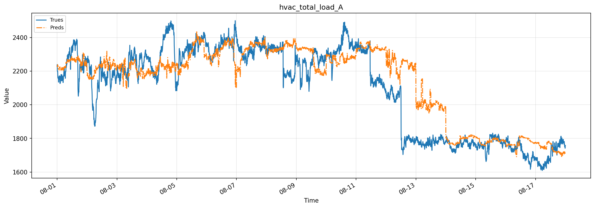

**B 路**：全期平均相对误差 4.53%（准确率 95.47%）。

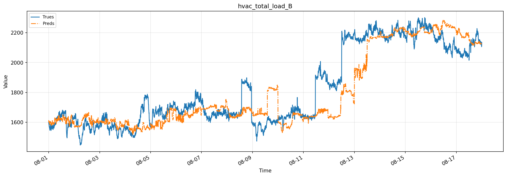

放大到单日，看推荐方案内部最好与最差的窗口：

**表现最好——A 路 8 月 15 日**：当日相对误差 1.45%（准确率 98.55%）；B 路 8 月 14 日当日相对误差 1.02%（准确率 98.98%），预测曲线与实际负荷几乎重合。

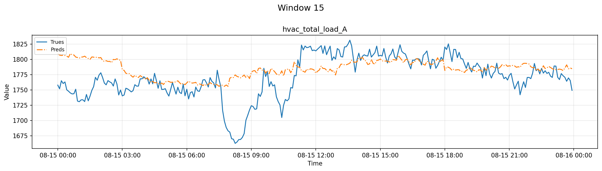

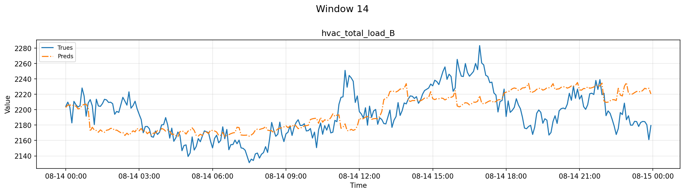

**表现最差——8 月 12 日（两路同日）**：A 路当日相对误差 17.30%，预测整体偏高约 320 千瓦；B 路当日相对误差 14.06%，预测整体偏低约 288 千瓦。当日两路负荷结构发生切换（见第五节第 4 条），模型以历史平稳模式外推，未能跟上。

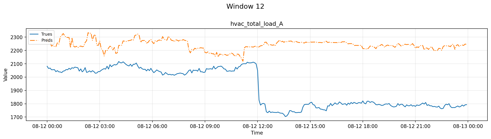

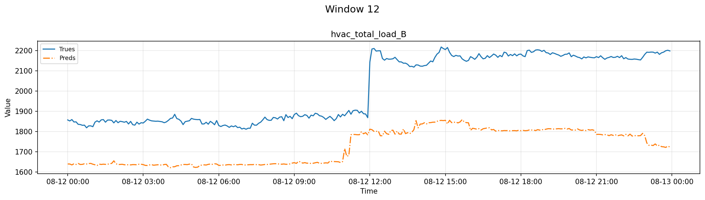

## 七、数据与测试边界说明

- 预测数据使用红框事件离线清洗版本（`redbox_past_v3`），清洗含人工事件区间复核，非严格在线可得；离线补值按普通数值参与训练和评分，评分未剔除这些点。
- IT 负荷历史组数据仅覆盖 8 月 4 日至 17 日，只有 7 个测试日；跨组比较一律采用第 4 步的配对 7 天口径，不能把各组 17 天全期数字直接互比。
- 天气组在测试段使用预报列，按「预测原点可得」假设入模，属研究性回放；其中 9 月 16 日部分小时值经双向离线插值修补（不影响本次 8 月 17 日截止的测试期）。
- 本报告全部结果来自历史数据逐日滚动回测（每天只用当时之前的数据训练，backtest-only），未做正式最终训练与未来预测，与未来实际运行的表现可能存在差异。
- 「逐步递推」与「整段统一建模」结果完全相同为设计使然（特征均取自至少一天前，递推不依赖当天预测值），不是数据错误。
- 全部 144 个实验（4 组信息组合 × 2 种设备口径 × 2 条路线 × 9 种预测方式）均已完成并纳入统计，无缺失单元格。
