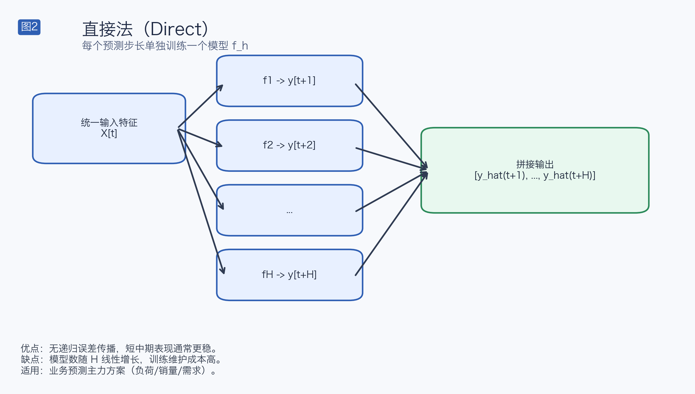
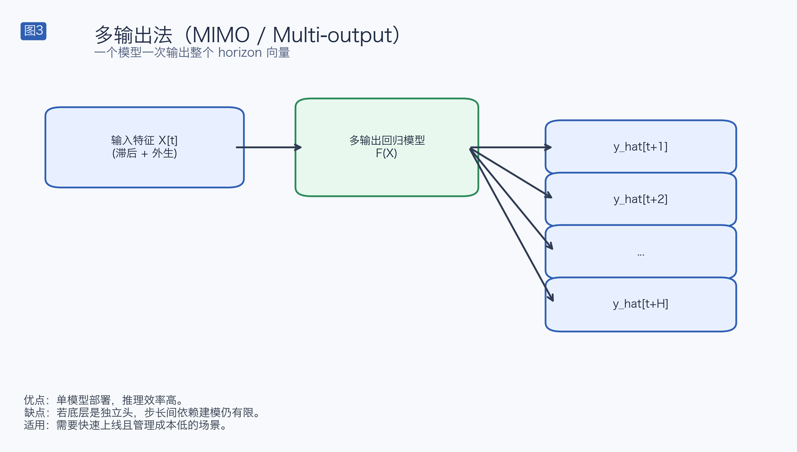
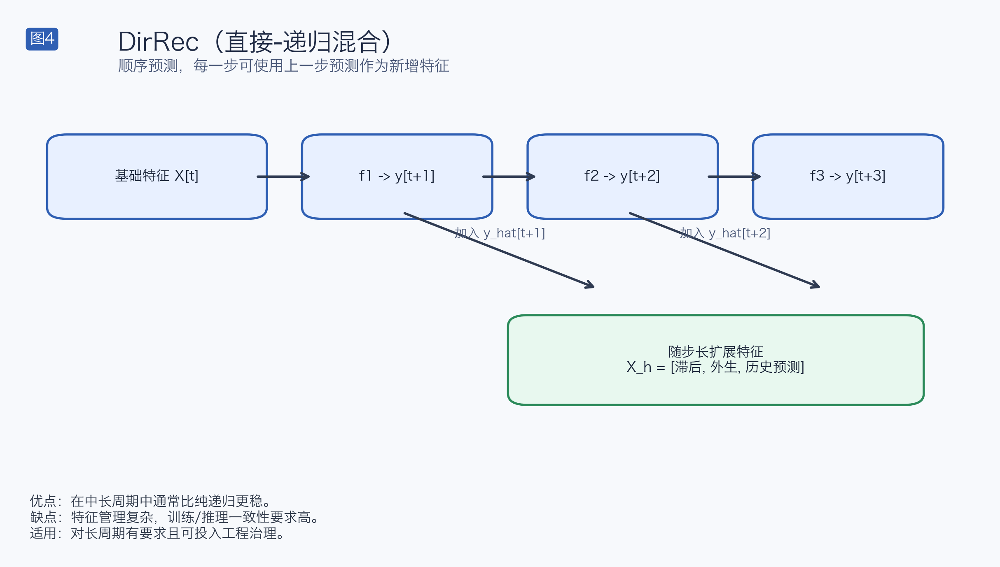

# 基于机器学习回归模型的时间序列多步预测方法调研（含原理图）

本文档专注于 **机器学习回归模型**（LightGBM / XGBoost / CatBoost / RandomForest / Linear Models）在多步预测中的常用方法，并与当前实现 `models/ModelForecasting.py` 逐项对比。

## 1. 业界常用多步预测方法与原理

> 图示规范（v2）：统一配色、统一编号（图1-图6）、中文标注、统一图例口径（优点/缺点/适用场景）。

### 1.1 Recursive（递归法）

核心原理：
- 训练一个一步模型 `f1`，只学 `y(t+1)`。
- 推理时把 `y_hat(t+1)` 回填到历史，再预测 `y_hat(t+2)`，循环到 `H`。

适用性：
- 优点：训练成本最低、模型管理最简单。
- 风险：误差逐步累积，长 horizon 易漂移。

### 1.2 Direct（直接法）

核心原理：
- 每个 horizon 单独训练：`f1` 预测 `t+1`，`f2` 预测 `t+2`，…，`fH` 预测 `t+H`。
- 预测时并行输出后拼接。

适用性：
- 优点：无递归误差传播，短中期稳定。
- 风险：模型数量多，训练和维护成本高。

### 1.3 MIMO / Multi-output（多输出直接法）

核心原理：
- 用一个模型一次输出整个 horizon 向量：`[y(t+1), ..., y(t+H)]`。
- 常见实现：`MultiOutputRegressor(base_estimator)`。

适用性：
- 优点：部署和推理简单。
- 风险：若底层是独立头（常见于 `MultiOutputRegressor`），跨 horizon 依赖建模有限。

### 1.4 DirRec（直接-递归混合）

核心原理：
- 顺序地做 horizon 预测，每一步可把前一步预测加入特征。
- 兼具 direct 与 recursive 的特点。

适用性：
- 优点：在中长 horizon 常较 recursive 更稳。
- 风险：特征 schema 管理复杂（列对齐、回填规则）。

### 1.5 Block Direct / DIRMO（分块直接法）

核心原理：
- 将 horizon 切成若干块，每块由一个多输出模型直接预测。
- 是 Direct 与 Recursive 间的工程折中。

适用性：
- 优点：模型数少于 Direct，误差传播小于 Recursive。
- 风险：块大小（block size）需要调参。

### 1.6 方法对比总览

## 2. 当前实现状态（以代码为准）

以下结论基于当前 `models/ModelForecasting.py`（并结合训练侧 `ModelTraining.py`）：

| 业界方法 | 当前实现 | 状态 |
|---|---|---|
| Recursive | `univariate_single_multi_step_recursive_forecast`、`multivariate_single_multi_step_recursive_forecast` | 已实现 |
| Direct | `univariate_single_multi_step_direct_forecast`、`multivariate_single_multi_step_direct_forecast` | 已实现 |
| Direct Output | `univariate_single_multi_step_direct_output_forecast` | 已实现 |
| DirRec | `univariate_single_multi_step_direct_recursive_forecast`、`multivariate_single_multi_step_direct_recursive_forecast` | 已实现 |
| Block Direct / DIRMO | USMDR、MSMDR 均为“每块一次模型调用”的严格分块实现 | 已实现 |
| MIMO / Multi-output | 训练侧支持 `MultiOutputRegressor` | 已实现 |
| Regressor Chain | 训练侧支持 `RegressorChain`（`multi_output_strategy`） | 已实现 |
| Quantile 多分位预测 | 训练侧量化模型 bundle + 预测侧统一分位推理 | 已实现 |
| Global（跨序列） | 支持 `enable_global_training` 与 `series_id` 特征透传（最小可用） | 部分实现 |

## 3. 当前代码实现要点（ModelForecasting）

1. 统一的预测入口与分位数输出
- 通过 `_predict_point_and_quantiles` 支持：
  - 点预测模型：直接返回预测值；
  - 分位数模型：返回中位分位点预测 + 所有分位点预测。
- `quantile_outputs` 在 `_predict_by_method` 前会重置，避免复用污染。

2. Direct 方法的输入构建已对齐 horizon-aware 外生特征
- `_build_direct_forecast_input` 采用“历史 `max_lag` + 全部未来外生行”，并在最后一个历史锚点取特征输入。
- 配合特征工程侧的 horizon 展开，可保证 direct 训练/推理语义一致。

3. 递归类方法的 schema 与状态管理
- 递归方法 (`USMR/MSMR`) 使用 `_recursive_schema_cache` 固定特征 schema。
- 推理阶段支持 `selected_features` 子集对齐，减少训练-推理特征漂移风险。

4. USMDR / MSMDR 已采用严格分块 direct 逻辑
- 每个块只调用一次模型，取该块长度的输出。
- 块间再进行历史回填（目标值必回填；MSMDR 对其他内生变量采用持久性填充）。

## 4. 下一步可优化点（当前版本剩余）

1. MSMR/MSMDR 中“其他内生变量”预测仍为持久性策略
- 当前默认使用 last-value 回填。
- 若业务里其他内生变量可预测，建议引入协变量子模型或场景输入，提高中长 horizon 稳定性。

2. Global 训练仍是最小可用版本
- 已支持 `series_id` 透传，但尚未形成完整多序列评估与采样策略（如按系列分层验证、跨系列权重策略）。

3. 测试配置对样本量敏感
- 当 `lags` 大、`history_days/window_days/predict_days` 不匹配时，容易出现有效样本不足。
- 建议在配置层增加自动可行性检查与窗口自适应降级。

## 5. 本次生成的图片文件

已生成并保存于 `../docs/assets/forecasting_imgs/`：
- `method_recursive_v2.png`
- `method_direct_v2.png`
- `method_mimo_v2.png`
- `method_dirrec_v2.png`
- `method_block_direct_v2.png`
- `method_comparison_matrix_v2.png`

## 6. 调研参考资料（核心）

1. Ben Taieb & Hyndman（多步策略文献入口）
- https://robjhyndman.com/publications/rectify/index.html

2. sktime reduction（direct / recursive / multioutput）
- https://www.sktime.net/en/stable/api_reference/auto_generated/sktime.forecasting.compose.make_reduction.html

3. scikit-learn MultiOutputRegressor
- https://scikit-learn.org/stable/modules/generated/sklearn.multioutput.MultiOutputRegressor.html

4. scikit-learn RegressorChain
- https://scikit-learn.org/stable/modules/generated/sklearn.multioutput.RegressorChain.html

5. skforecast（回归模型 direct/recursive 实战）
- https://skforecast.org/latest/

6. M5 Accuracy（LightGBM 与多步策略工业实践）
- https://statmodeling.stat.columbia.edu/wp-content/uploads/2021/10/M5_accuracy_competition.pdf

7. LightGBM / XGBoost / CatBoost 文档（含 quantile 相关能力）
- https://lightgbm.readthedocs.io/
- https://xgboost.readthedocs.io/en/stable/parameter.html
- https://catboost.ai/docs/en/concepts/loss-functions-regression
