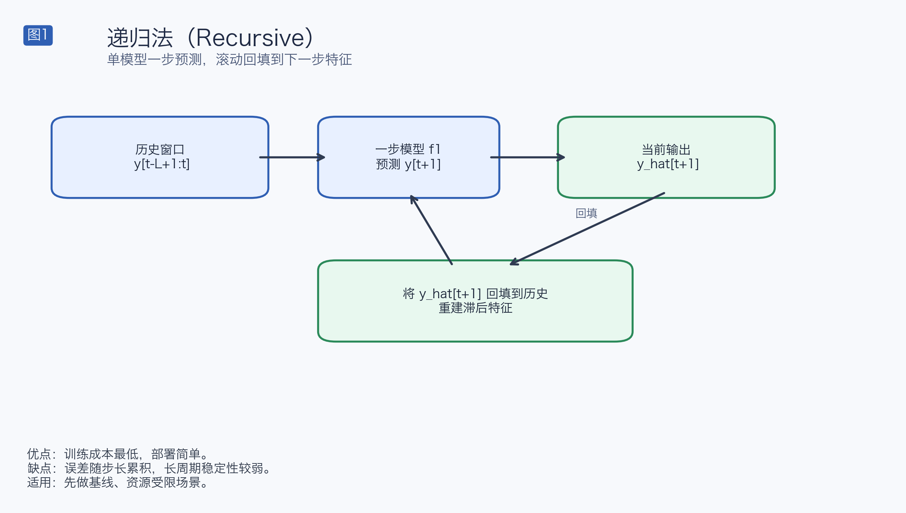
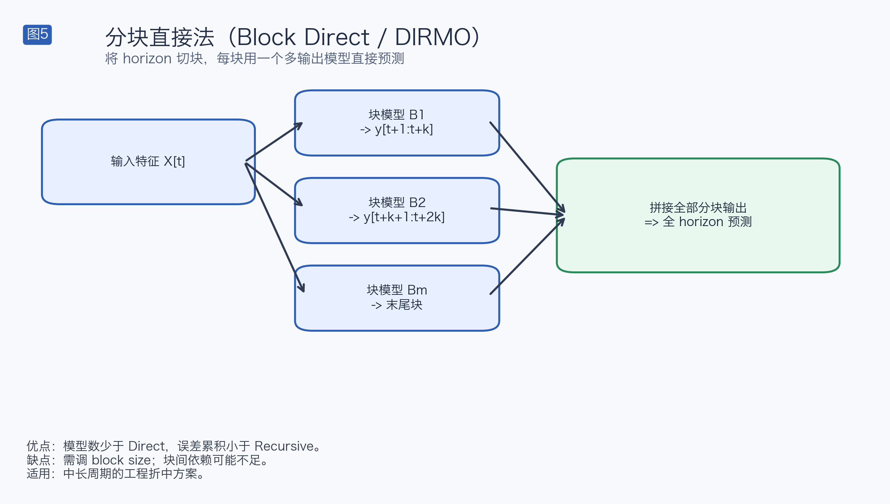
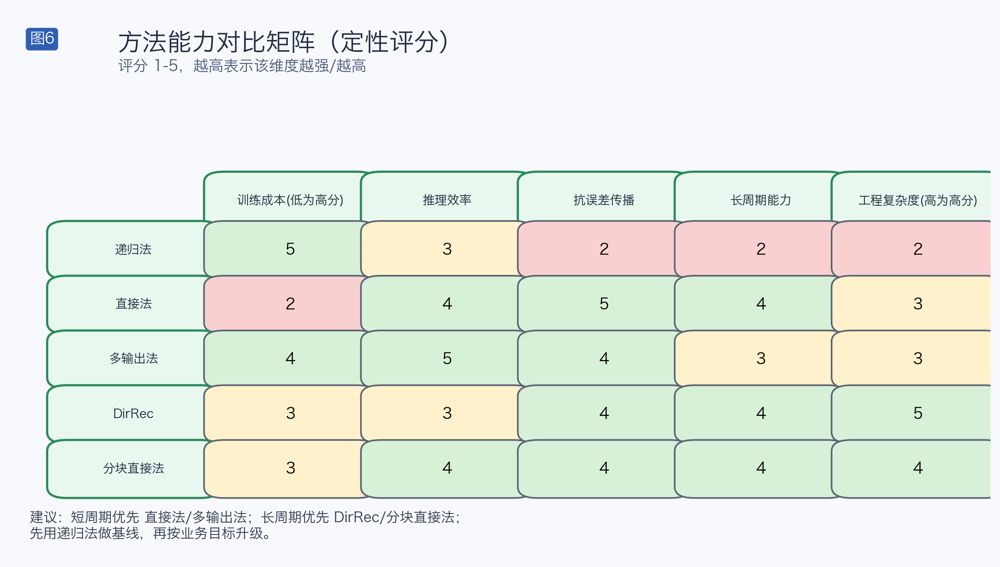

# 基于机器学习回归模型的时间序列多步预测方法调研（含原理图）

本文档专注于 **机器学习回归模型**（LightGBM / XGBoost / CatBoost / RandomForest / Linear Models）在多步预测中的常用方法，并与当前实现 `models/ModelForecasting.py` 逐项对比。

## 1. 业界常用多步预测方法与原理

> 图示规范（v2）：统一配色、统一编号（图1-图6）、中文标注、统一图例口径（优点/缺点/适用场景）。

### 1.1 Recursive（递归法）

核心原理：
- 训练一个一步模型 `f1`，只学 `y(t+1)`。
- 推理时把 `y_hat(t+1)` 回填到历史，再预测 `y_hat(t+2)`，循环到 `H`。

适用性：
- 优点：训练成本最低、模型管理最简单。
- 风险：误差逐步累积，长 horizon 易漂移。

### 1.2 Direct（直接法）

核心原理：
- 每个 horizon 单独训练：`f1` 预测 `t+1`，`f2` 预测 `t+2`，…，`fH` 预测 `t+H`。
- 预测时并行输出后拼接。

适用性：
- 优点：无递归误差传播，短中期稳定。
- 风险：模型数量多，训练和维护成本高。

### 1.3 MIMO / Multi-output（多输出直接法）

核心原理：
- 用一个模型一次输出整个 horizon 向量：`[y(t+1), ..., y(t+H)]`。
- 常见实现：`MultiOutputRegressor(base_estimator)`。

适用性：
- 优点：部署和推理简单。
- 风险：若底层是独立头（常见于 `MultiOutputRegressor`），跨 horizon 依赖建模有限。

### 1.4 DirRec（直接-递归混合）

核心原理：
- 顺序地做 horizon 预测，每一步可把前一步预测加入特征。
- 兼具 direct 与 recursive 的特点。

适用性：
- 优点：在中长 horizon 常较 recursive 更稳。
- 风险：特征 schema 管理复杂（列对齐、回填规则）。

### 1.5 Block Direct / DIRMO（分块直接法）

核心原理：
- 将 horizon 切成若干块，每块由一个多输出模型直接预测。
- 是 Direct 与 Recursive 间的工程折中。

适用性：
- 优点：模型数少于 Direct，误差传播小于 Recursive。
- 风险：块大小（block size）需要调参。

### 1.6 方法对比总览

## 2. 你的实现与业界常用方法的对比

当前 `ModelForecasting.py` 方法映射：

| 业界方法 | 你当前实现 | 结论 |
|---|---|---|
| Recursive | `univariate_single_multi_step_recursive_forecast`、`multivariate_single_multi_step_recursive_forecast` | 已覆盖 |
| Direct | `univariate_single_multi_step_direct_forecast`、`multivariate_single_multi_step_direct_forecast` | 已覆盖 |
| MIMO / Multi-output | 训练侧 `MultiOutputRegressor`（`ModelTraining.py`）+ direct 推理 | 已覆盖（基础版） |
| DirRec | `univariate_single_multi_step_direct_recursive_forecast`、`multivariate_single_multi_step_direct_recursive_forecast` | 已覆盖 |
| Block Direct / DIRMO | 当前“分块”实现更偏分块递归 | 部分覆盖 |
| Regressor Chain | 未实现 | 缺失 |
| Quantile 多分位预测 | 未实现 | 缺失 |
| Global（跨序列联合） | 未体现 `series_id` 联合建模 | 缺失 |

## 3. 与你当前实现的关键区别（代码级）

1. `USMD/MSMD` 推理阶段只用未来第一个外生点构建输入
- 代码位置：`models/ModelForecasting.py` 约 138-170 行、330-366 行。
- 区别：业界 direct 常按 horizon 使用 `X_exog(t+h)`，你当前实现会弱化外生变量时变信息。

2. `MSMR` 目标映射依赖 `_shift_1` 字符串替换
- 代码位置：约 387-449 行。
- 区别：业界更常用显式 target schema，降低列错位风险。

3. `MSMDR` 对其他内生变量采用持久性回填
- 代码位置：约 507-572 行。
- 区别：业界通常会为关键协变量提供独立预测器或场景输入，不仅使用 last-value。

4. 当前“分块策略”仍以递归回填为主，不是严格 block-direct
- 代码位置：约 245-304 行、495-590 行。
- 区别：严格 DIRMO 是“按块直接训练/预测”，递归依赖更弱。

## 4. 面向你实现的优化建议

### P0（优先做）

1. `USMD/MSMD` 改为 horizon-aware 外生特征
- 每个 `h` 使用 `X_exog(t+h)`。
- 对应训练目标 `y(t+h)`，保证训练/推理一致。

2. 增加统一 `FeatureSchema` 校验
- 训练与预测强制列顺序、类型、缺失列补齐策略一致。

### P1

1. 新增 `RegressorChain` 策略
- 用于增强多输出情况下 horizon 间依赖建模。

2. 新增 Quantile 预测
- 输出 `P10/P50/P90`，为业务提供不确定性区间。

### P2

1. 将当前分块递归扩展为严格 `Block Direct (DIRMO)`
- 每块训练一个多输出模型，减少递归传播。

2. 增加 Global 训练模式
- 跨序列联合训练（`series_id` + 静态特征），提升泛化与样本利用率。

## 5. 本次生成的图片文件

已生成并保存于 `models/imgs/`：
- `method_recursive_v2.png`
- `method_direct_v2.png`
- `method_mimo_v2.png`
- `method_dirrec_v2.png`
- `method_block_direct_v2.png`
- `method_comparison_matrix_v2.png`

## 6. 调研参考资料（核心）

1. Ben Taieb & Hyndman（多步策略文献入口）
- https://robjhyndman.com/publications/rectify/index.html

2. sktime reduction（direct / recursive / multioutput）
- https://www.sktime.net/en/stable/api_reference/auto_generated/sktime.forecasting.compose.make_reduction.html

3. scikit-learn MultiOutputRegressor
- https://scikit-learn.org/stable/modules/generated/sklearn.multioutput.MultiOutputRegressor.html

4. scikit-learn RegressorChain
- https://scikit-learn.org/stable/modules/generated/sklearn.multioutput.RegressorChain.html

5. skforecast（回归模型 direct/recursive 实战）
- https://skforecast.org/latest/

6. M5 Accuracy（LightGBM 与多步策略工业实践）
- https://statmodeling.stat.columbia.edu/wp-content/uploads/2021/10/M5_accuracy_competition.pdf

7. LightGBM / XGBoost / CatBoost 文档（含 quantile 相关能力）
- https://lightgbm.readthedocs.io/
- https://xgboost.readthedocs.io/en/stable/parameter.html
- https://catboost.ai/docs/en/concepts/loss-functions-regression
